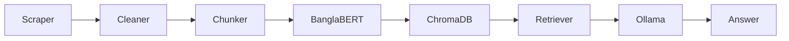

# BanglaMed-RAG


Retrieval-augmented generation for Bengali biomedical QA using Bangla-BERT and local LLMs.

## Motivation
Bangla has 230M+ speakers, yet high-quality medical QA tools remain scarce. This repo builds a fully local, zero-paid-API RAG stack for Bengali biomedical knowledge.

## Architecture


## Results (RAGAS)
| Metric | Score |
| --- | --- |
| Faithfulness | TBD |
| Answer Relevancy | TBD |
| Context Precision | TBD |
| Context Recall | TBD |

## Quickstart (Docker)
```bash
git clone https://github.com/sillyfellow21/BanglaRagNLP.git
cd BanglaRagNLP
cp .env.example .env
docker-compose up --build
```
Open Streamlit: http://localhost:8501

Pull a local model inside the Ollama container:
```bash
docker-compose exec ollama ollama pull phi3
```

## Local Development
```bash
python -m pip install -e ".[dev]"
ollama pull phi3
python -m banglamed_rag.scraper
python -m banglamed_rag.cleaner
python -m banglamed_rag.vectorstore
python -m banglamed_rag.evaluator
streamlit run app/streamlit_app.py
```
FastAPI docs: http://localhost:8000/docs

## Configuration
- `OLLAMA_BASE_URL` (default `http://localhost:11434`)
- `OLLAMA_MODEL` (default `phi3`)
- `EMBED_MODEL` (default `sagorsarker/bangla-bert-base`)

If you run outside Docker, set `OLLAMA_BASE_URL=http://localhost:11434` in your `.env`.

## Data Notes
- Raw pages are saved in `data/raw/` (gitignored).
- Cleaned chunks are saved in `data/processed/corpus_clean.jsonl` (gitignored).
- Benchmarks live in `data/qa_benchmark.json` (committed).

## Citation
- sagorsarker/bangla-bert-base
- RAGAS
- LangChain
- ChromaDB
